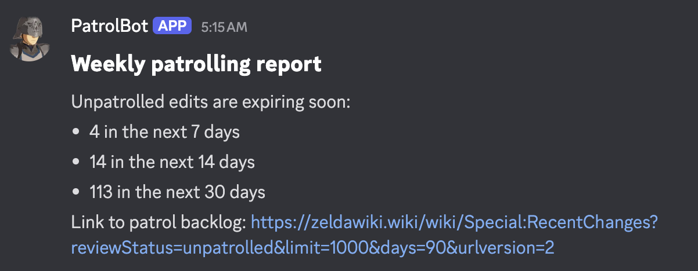
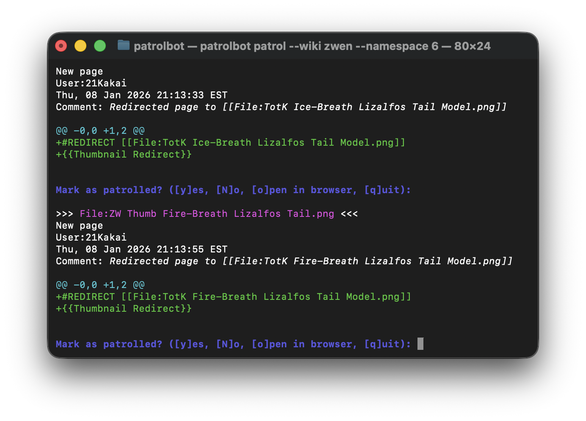

# PatrolBot

[](https://codecov.io/gh/iocalebs/patrolbot)

PatrolBot is a Discord bot and command-line tool that assists with [patrolling](https://www.mediawiki.org/wiki/Help:Patrolled_edits) MediaWiki sites. It was initially built for [Zelda Wiki](http://zeldawiki.wiki), but it is designed to be usable by any wiki in any language.




## Discord Bot

The PatrolBot Discord bot can generate reports on the state of a wiki's patrol backlog. These reports can be generated [periodically](.github/workflows/weekly.yaml) or on-demand via the `/report` command.

| Command | Description |
| ------- | ----------- |
| `/report <type>` | Generate a report using data from one or more MediaWiki [Action API](https://www.mediawiki.org/wiki/API:Action_API) queries. |z

## CLI

The PatrolBot CLI (command line interface) helps patrollers work through the wiki's backlog via keyboard interface. It can be helpful for multiple maintenance edits in rapid succession. It can also be used for patrolling revisions that are difficult or impossible to access via Special:RecentChanges, such as deleted files and old revisions hidden by [link limits](Manual:$wgRCLinkLimits). 

### Getting started

To install and run the PatrolBot CLI:

1. [Install Go](https://go.dev/doc/install)

2. Install PatrolBot:

```sh
go install github.com/iocalebs/patrolbot@latest
```

3. Initialize PatrolBot configuration:

```sh
patrolbot init
```

4. Start patrolling:

```sh
patrolbot patrol
```

Run `patrolbot --help` for more information on available CLI commands.

## Configuration

If you wish to customize PatrolBot for your own wiki's purposes, note that the bot uses [config.yaml](./config.yaml) and [templates](./templates/) to determine what reports are available, how they're worded, and what API queries they use.

- See [`Config`](https://pkg.go.dev/github.com/iocalebs/patrolbot/internal/config#Config) type documentation details on supported configuration properties
- See [`ReportData`](https://pkg.go.dev/github.com/iocalebs/patrolbot/internal/report/data#ReportData) type documentation for details on the data available in report templates.
- See [`text/template`](https://pkg.go.dev/text/template) for general information on the Go template syntax used for PatrolBot reports.

A [JSON Schema](https://raw.githubusercontent.com/iocalebs/patrolbot/refs/heads/trunk/config.schema.json) is available for validation and editor autocompletion of `config.yaml`.
